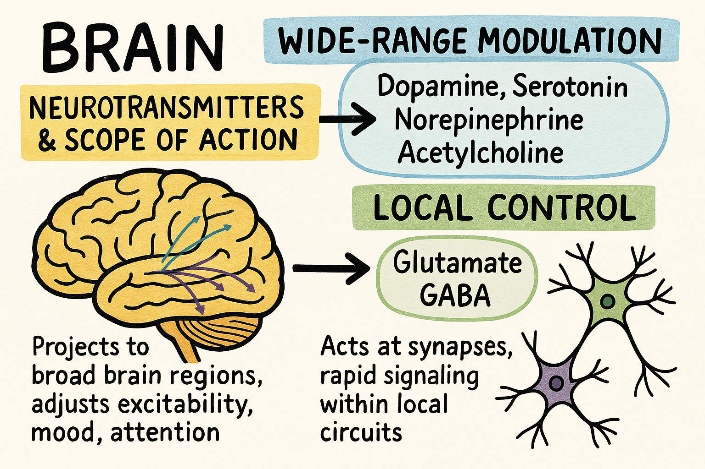

脳

⸻
[* 脳内物質と効果範囲（広範囲魔法と単体魔法）]
脳内物質の効果範囲には広範囲調節用と局所制御用の2種類がありそれぞれ対応する神経伝達物質が決まっている。

 広範囲に影響を与える神経調節物質（例えばドーパミン、セロトニン、ノルアドレナリン、アセチルコリンなど）は、広い脳領域に投射され、ゆっくりとした作用で全体の興奮状態や気分、注意などを調節します。

 局所制御用の神経伝達は、シナプス間隙で速やかに作用する神経伝達物質（例えばグルタミン酸やGABA）が主に担い、特定の局所回路内で迅速な情報伝達と制御を行います。

[* どこからでるか]
広範囲系神経伝達物質は、特定の神経核(同じ機能や性質を持つニューロンの細胞体部分の集まり)から広範囲へ投射される形で分泌されます。たとえば、
 	ドーパミン：中脳の腹側被蓋野（VTA）や黒質から放出され、運動制御や報酬系に関与
 	セロトニン：脳幹のラフェ核から放出され、気分や睡眠の調節に関与
 	ノルアドレナリン：青斑核から放出され、覚醒や注意の調節に関与
 	アセチルコリン：基底前脳（例えば、Meynert核）や脳幹の一部から放出され、学習や記憶に関与

局所的神経伝達物質（例えばグルタミン酸やGABA）は、各ニューロンのシナプス終末から放出され、特定の神経回路内で速やかな情報伝達を担っています。ただ、グルタミン酸は運動皮質から脊髄までなど、長い軸索を伸ばしていることが多いです。

このように、広域調節用と局所制御用の神経伝達物質は、それぞれ異なる領域（特定の神経核と局所回路のシナプス終末）から放出され、異なる役割を果たしています。

⸻
[* 空間的な分類と階層的な分類]
空間的な分類と階層的な分類の両面から脳内のニューロンを整理すると、以下のように考えることができます。

 （空間的）脳の領域による分類
 	大脳皮質のニューロン：
   大脳皮質は6層構造になっており、各層には形態や機能が異なるニューロン（例：ピラミッド細胞、星状細胞など）が存在します。たとえば、層Vのピラミッド細胞は運動出力に重要な役割を果たします。
 	小脳のニューロン：
 	 小脳では、プルキンエ細胞、顆粒細胞、ゴルジ細胞などがあり、運動の調整や協調に寄与します。
 	視床や脳幹など：
 	 視床は感覚情報の中継や統合、脳幹は生命維持に関わる基本的な制御を行うなど、各部位で専門的な役割を果たすニューロンが配置されています。

	（階層的）情報処理の段階に基づく分類
		一次処理層（低次処理）：
			感覚入力（視覚、聴覚、触覚など）の初期段階で、エッジや基本的な形状、音の特徴など単純な情報を抽出するニューロンが含まれます。
			例として、一次視覚野のニューロンは、光のコントラストや方向などの低次特徴を検出します。
		中間層（連合層）：
			複数の感覚情報を統合し、パターン認識や簡単な連想、局所的な統合処理を行うニューロンがここに位置します。
			この層では、抽出された単純な特徴が組み合わされ、より複雑な形状や動作のパターンが認識されます。
		高次処理層（抽象化層）：
			中間層で統合された情報をさらに処理し、認知、意思決定、記憶の形成など高次の機能を担うニューロンが働きます。
			例として、前頭前野に位置するニューロンは、計画や問題解決、意思決定に寄与します。

-------------
[* レセプターのフィードバック]
レセプターのフィードバックとは、神経伝達物質が受容体に結合した結果、細胞自体や近隣の細胞が、その情報をもとに自らの活動を調節する仕組みを指します。

例えば以下のようなフィードバックが存在します。
	1.	オートレセプターによる自己調節
　多くのニューロンは、自分が放出する神経伝達物質に反応する「オートレセプター」を持っています。これらは、シナプス終末に存在し、神経伝達物質が過剰に放出されるのを防ぐために、逆に神経伝達物質の放出を抑制する負のフィードバック機構を働かせます。
	2.	受容体の内在化や感受性調整
　長時間にわたり刺激が強くなると、受容体が細胞膜から取り込まれて数が減少したり、受容体自体の感受性が下がったりすることがあります。これにより、同じ刺激に対しての応答が弱まり、過剰な反応を抑える効果が得られます。
	3.	シグナル伝達経路を通じた調整
　受容体が活性化されると、細胞内のシグナル伝達経路（例えば、cAMP経路やカルシウムシグナルなど）が活性化され、これがフィードバックとして放出される神経伝達物質の量や、受容体の活性状態に影響を与えます。これにより、神経回路全体のバランスが保たれるように調整されます。

このようなフィードバック機構により、神経系は過剰な刺激を防ぎ、適切な情報伝達を維持できるのです。

| 脳内物質           | 分泌部位                           | 効果範囲           | 主な役割                | 興奮性 or 抑制性       |
|--------------------|------------------------------------|--------------------|-------------------------|------------------------|
| ドーパミン         | 中脳（VTA、黒質）                  | 広範囲             | 運動制御、報酬系         | 調節的（受容体依存）   |
| セロトニン         | 脳幹のラフェ核                     | 広範囲             | 気分、睡眠の調節         | 調節的（受容体依存）   |
| ノルアドレナリン   | 青斑核（脳幹）                     | 広範囲             | 覚醒、注意の調節         | 主に興奮性             |
| アセチルコリン     | 基底前脳（Meynert核）、脳幹        | 広範囲             | 学習、記憶               | 主に興奮性             |
| グルタミン酸       | 大脳皮質など広く分布               | 局所               | 興奮性の情報伝達         | 興奮性                 |
| GABA              | 局所回路（抑制性インターニューロン）| 局所               | 抑制性の情報伝達         | 抑制性                 |