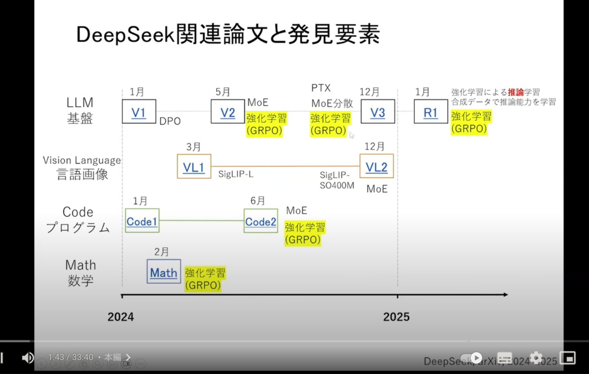
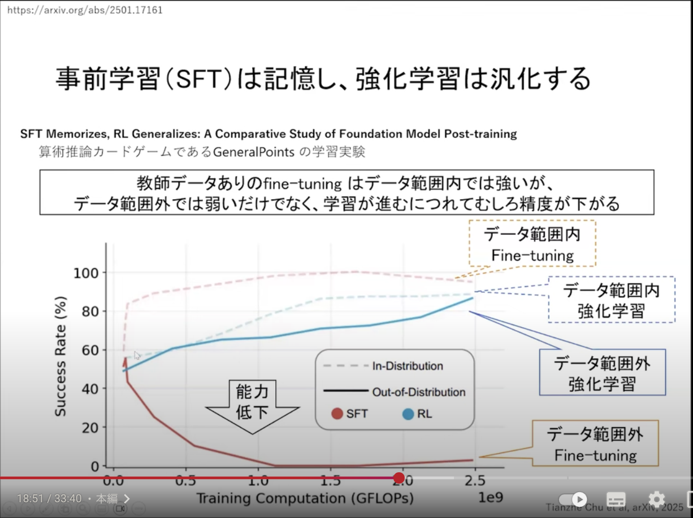

| 観点 | DeepSeek-R1の特徴 | ChatGPT oシリーズの特徴（o1, o3 など） | DeepSeek-R1の優位性 |
|------|-------------------|--------------------------------------|-------------------|
| モデルアーキテクチャの革新性 | Mixture-of-Experts (MoE) 構造を採用し、総パラメータ数6710億・各推論で有効になるパラメータは約370億と巨大モデルながら効率的に動作 。128Kという非常に長いコンテキスト長に対応し、Multi-Head Latent AttentionやMulti-Token Prediction (MTP) といった独自の注意機構・学習目標を導入  。これにより一度に複数トークンを予測する能力も備えている。 | 詳細なアーキテクチャは非公開だが、従来型の大規模Transformer（密結合型の巨大言語モデル）と推察される。MoEのような明示的なエキスパート分離は用いず、単一のモデルが全トークンを処理する設計。内部的な層構造や注意機構の改良によって高い汎用性能を実現していると考えられる。 | MoEにより必要計算量あたりの性能が高く、密結合モデルに比べスケーラビリティと効率性で優位性がある。MTPによる並列デコードで推論高速化も可能なため、巨大な密モデルを用いるChatGPTに比べ計算効率で勝る  。また128Kもの長大な文脈を保持できる点もDeepSeek-R1の強みである。 |
| 学習データの構成と最適化方針 | 約14.8兆トークンの多様かつ高品質なデータで事前学習を行ったDeepSeek-V3-Baseを基礎に、教師なし強化学習(RL)を直接適用して推論力を引き出したモデル「DeepSeek-R1-Zero」をまず開発 。その後、出力の可読性や安定性を改善するため少量のコールドスタートデータで一度SFT（教師あり微調整）を施し、再度RLで推論能力を強化する多段階学習パイプラインで最終モデルDeepSeek-R1を構築 。 | GPT-4など従来モデル同様、インターネットコーパス等からなる巨大全文データで事前学習。その上で人間による高品質な指示データや問題解答を用いた教師あり微調整 (SFT) と、報酬モデルを用いた人間のフィードバックによる強化学習 (RLHF) を経てモデルを最適化している。o1シリーズでは**チェイン・オブ・ソート(CoT)**による思考過程をモデルに内包させるため、大規模なRLを用いてモデル自身に推論戦略を学習させる方針を採用 。 | 大規模な人手ラベルデータにあまり依存せず、RLによってモデルの論理推論能力を引き出した点で革新的 。OpenAIのモデルが高度な性能達成に大量の人手によるSFTやRLHFを必要とするのに対し、DeepSeek-R1は最小限のSFTと自律的なRLで同等の推論力を実現しており、人手コストやデータ効率の面で優位性を示す 。 |
| ベンチマーク性能 | 数学・プログラミング・知識質問など幅広いベンチマークで最先端に迫る成績を記録。例えば英語学術テストのMMLUでは90.8とOpenAI-o1の91.8に肉薄し 、難解な数学問題集MATHでは97.3とOpenAI-o1を僅かに上回る正解率を達成 。総合的に、従来閉源モデルが持っていたトップ水準の性能に匹敵する結果を示している。 | OpenAIのo1モデルはMMLUや数学・コードベンチマークで当時最高水準のスコアを達成し  、o3ではさらに広範なタスクで性能が向上したと考えられる。例えばMMLUで91.8の高スコア、Codeforces（競技プログラミング難易度）でレーティング2061相当といった卓越した結果を示す  。これらは汎用知識から高度な専門課題まで安定した強さを発揮することを意味する。 | オープンモデルでありながらClosed-source SOTAに迫るスコアを叩き出した点が特筆される。特に追加の専門チューニング無しで高度な数学・論理タスクに対応でき、MATHの正答率など一部指標ではOpenAI-o1を凌駕する 。高性能とオープン性の両立により、従来は閉源モデルが独占していたベンチマーク分野で競争力を持つ点がDeepSeek-R1の優位性である。 |
| 推論速度・コスト効率 | アーキテクチャ上の工夫（MoEの専門家ルーティングやFP8精度の活用）により、学習・推論ともにコスト削減を実現。報告によればモデル訓練およびデプロイのコストはOpenAI-o1比で約95%減と極めて低く 、推論APIの利用料金も入力100万トークンあたり約$0.55・出力$2.19と、GPT-4 APIの$15・$60に比べ極めて安価 。またMTPに基づくスペキュレイティブデコーディングで応答生成を高速化できるため 、ユーザ待ち時間の短縮にも寄与している。 | 大規模モデルながらOpenAI側で最適化が施され、実用上許容できる応答速度は確保しているものの、推論には依然莫大な計算資源を要しコストも高額。GPT-4(oシリーズ)のAPI利用料は出力100万トークンあたり約**$60**と高く設定されており 、長文応答では応答待ちも長くなる傾向がある。コスト面の課題に対処すべく、OpenAIは性能を抑え計算負荷を下げた派生モデル（o1-miniやo3-mini）を投入し、より安価な推論オプションも提供し始めている 。 | 低コストかつ高速という点で明確な優位性がある。オープンソースゆえ自前サーバでの推論が可能でライセンス料金が不要な上、MoEにより不要な計算を省いているため計算資源当たりの出力効率が高い 。その結果、同程度の問題を解くのに要する計算コストはChatGPT側のごく数％程度（約1/20）に抑えられている  。推論時間も短縮でき、ユーザは高速・低価格で高度な推論サービスを利用できる。 |
| モデルの透明性・公開方針 | 完全オープンソースとしてモデルが公開されており、誰でも利用・改良可能 。DeepSeekは技術レポートとともにDeepSeek-R1の重みを公開し、さらに派生の小型モデル群（1.5B〜70Bに及ぶ蒸留モデル）も無償提供している 。またモデルの思考過程を可視化する設定（推論中のCoT表示）も備えており、回答に至る経緯をユーザが直接確認できる点で透明性が高い 。 | OpenAIのoシリーズはクローズドソースであり、モデル重みや学習データセットは非公開。利用者はOpenAI提供のAPIやChatGPTで間接的にアクセスするしかなく、モデル内部に直接触れることはできない 。モデルが内部で行うチェイン・オブ・ソート推論も外部からは観察不可能で、出力のみが提供される。研究目的での検証や独自改良も難しく、モデルの挙動は開発元にとってブラックボックス的に管理されている。 | オープンソースゆえに外部からの検証・改良が容易である。研究者や開発者はDeepSeek-R1の内部動作を分析し、新たな手法を試す基盤として活用可能で、実際リリース直後から500以上の派生モデルが公開されるなどコミュニティ主導の発展が見られる 。またモデルの推論過程を可視化できるため 、出力の根拠を追跡しやすく信頼性評価に役立てられる。このように透明性・開放性の面でDeepSeek-R1は大きな優位性を持つ。 |
| その他独自の工夫 | 自己内省・自己検証のメカニズムを強化している。RL訓練中に「Ahaモーメント」と呼ぶ発見的瞬間をピボットトークンとして挿入し、モデルが途中で解答方針を見直し再評価する仕組みを取り入れた 。その結果、回答の妥当性を自らチェック・訂正するリフレクション能力が現れ、長い推論経路を経て正答に辿り着く傾向が強まっている 。さらに、得られた高度な推論パターンを既存の標準LLMに蒸留する手法を開発し、LlamaやQwenベースの小型モデルでも大幅な性能向上を実現した 。 | ChatGPTのoシリーズも内在的な思考プロセスを活用する工夫が凝らされている。モデルは回答を生成する前に内部で推論を重ね（「考えてから答える」挙動）、必要に応じてセルフチェックや方針修正を行っている 。特に安全性の分野ではモデル自身が与えられたポリシーを参照しながら応答内容を推敲する熟慮的アラインメント手法を導入しており、禁止事項に抵触しないよう内部のチェイン・オブ・ソートで検討してから回答する 。これにより安全性と高性能を両立させているが、これら独自手法の詳細は非公開である。 | DeepSeek-R1で用いられた**「考えるモデル」の戦略が公開されている点は大きな強みである。例えばピボットトークンを用いた自己内省や自己検証の手法はコミュニティで知見が共有され、他モデルへの応用や検証が可能となっている。さらに蒸留技術により大型モデルの推論様式を小型モデルに移植できることを示し 、リソースの限られた環境でも高い推論性能を実現しうる道筋を開拓した。また、OpenAIモデルに比べ応答への制約が少なく創造性が高い**との指摘もあり 、ユーザの多様な要求に柔軟に対応できる点でも利点がある。 |

https://www.youtube.com/watch?v=Dtq20_ftiBc

